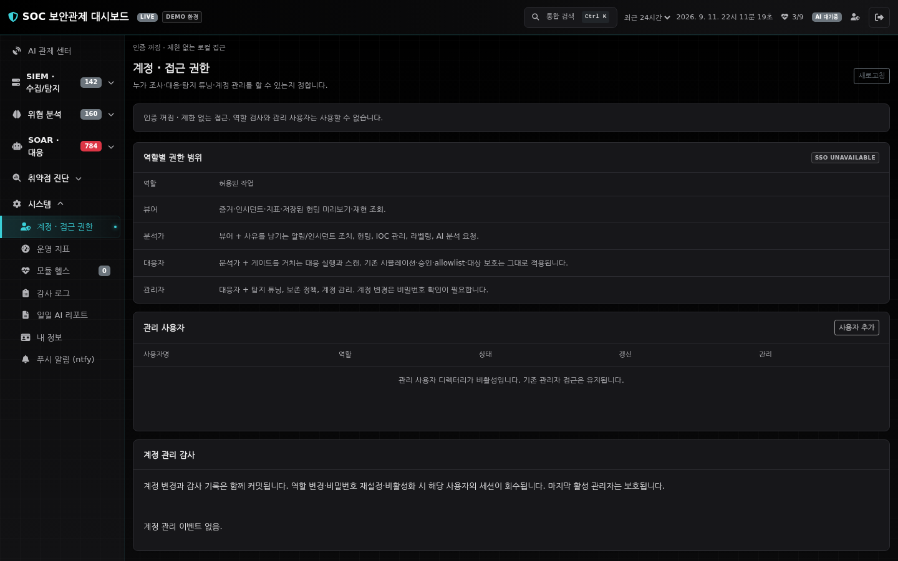

# TRACE access control

Implemented 2026-09-09 in the existing Flask application. This is local, single-tenant
role enforcement with revocable sessions. OIDC/SAML SSO, MFA, tenant separation and
independent security certification are **UNAVAILABLE**. No identity-provider token
or trusted-header login is accepted.



*Isolated DEMO environment and temporary example accounts; no operational user data.*

## Roles

| Role | Work permitted |
| --- | --- |
| Viewer | Read shared evidence, cases, audit, metrics and replay; preview saved hunts; change own managed password. |
| Analyst | Viewer + alert ACK/closure/verdict, case editing, hunts, IOC management, labeling, AI requests, report generation and recorded SIEM searches. |
| Responder | Analyst + scanning and response requests, including block/approval/unblock, EDR termination and patch/command execution. Existing target validation and response gates still apply. |
| Administrator | Responder + detection/ML tuning, playbook toggles, retention/archive, integration test notifications and account administration. |

The policy inventories every mutation by **Flask endpoint name**, in
`modules/authorization.py`. Unknown writes fail closed, including for administrators.
A test requires an exact match between this inventory and all registered mutation
routes. New writes must declare a permission; URL prefix matching is not sufficient.
The current read boundary is shared SOC evidence. Users are not restricted by asset,
case, department or tenant. Only administrators read the managed-user directory and
identity administration audit. All roles can read the existing operational audit.

Client button states communicate these boundaries. They are not authorization:
Flask checks the current server-side principal before calling the API handler.
The top bar/menu show the role; `AUTH_ENABLED=False` visibly says unrestricted.
Existing automated SOAR workers keep their configured service policy; RBAC governs
human requests and does not silently change automation, approvals or simulation.

## Enable managed users

Managed mode is opt-in to preserve existing deployments. No `.env`, operational
identity database, running process or protected server was changed by this iteration.

1. Provision an administrator into a new identity database, using the application
   service account. Password entry is interactive and is never a command argument:

   ```bash
   ./venv/bin/python scripts/manage_users.py --db data/users.db create soc-admin --role admin
   ```

2. In your deployment configuration, set `AUTH_ENABLED=True` and
   `AUTH_USERS_DB=data/users.db` (an absolute path avoids working-directory ambiguity).
   Keep a stable secret `SECRET_KEY`. Use `DEBUG=False`, an appropriate trusted
   network boundary, and `SESSION_COOKIE_SECURE=True` when serving over HTTPS.
3. Restart through your deployment's normal change process, sign in, and verify
   **Settings → Access & roles → MANAGED**. Create least-privilege analyst accounts.
4. Test a second administrator and recovery access before retiring old credentials.

Alternatively, when managed mode is explicitly enabled and its directory is empty,
the existing configured `DASH_USERNAME`/`DASH_PASSWORD_HASH` (or password) bootstraps
one administrator. This happens only once; restarting never overwrites managed users.
New managed passwords require 12–256 characters and use Werkzeug's password hashing.
Usernames are case sensitive, 3–64 ASCII letters/digits/dot/@/underscore/hyphen.

After bootstrap, managed credentials are authoritative. Legacy environment credentials
do not remain a second login path. Remove obsolete secrets from deployment configuration
when your recovery plan no longer needs them. A fresh deployment with authentication
on and no configured credentials refuses login; it does **not** generate and log a password.

If `AUTH_USERS_DB` is blank, the existing single administrator remains available.
It now uses a revocable in-process session ledger. A restart invalidates these sessions.
Auth-disabled mode remains explicit unrestricted local/demo mode; it is not a role-based
production configuration. Identity changes return 503 in unmanaged/disabled modes.

## Account changes and session lifecycle

- Access & roles supports account creation, role changes, disabling, password resets
  and revoking all sessions. Each operation requires the administrator's current
  password and a reason/approval reference. Password confirmation uses the existing
  IP-based login limiter. An administrator cannot demote or disable themself; the
  last active administrator cannot be removed, including via local recovery.
- Account changes and their identity audit entry commit in **one SQLite transaction**.
  Audit failure rolls back the account change. No password/hash/session token appears
  in these responses or audit details. Identity audit is a separate table in users.db;
  the UI shows its latest 100 events, while the database retains the history.
- Role/password/active-state changes increment the account version and revoke its
  sessions. Administrator identity, active state and version are rechecked within
  the write transaction. A password-check/reset race cannot issue an old-version login.
- Login rotates a random opaque session token. SQLite stores only its SHA-256 digest.
  The signed browser session contains the opaque token and a display username; roles
  and usernames from cookies never authorize a request. Expiry is absolute, using
  `SESSION_HOURS`; activity does not extend it. At most 20 active sessions per account.
- Logout is a same-origin-checked POST. GET `/logout` displays a confirmation page.
  Replaying the old signed cookie after logout does not restore access.
- Engine.IO handshake origins use the same-origin default (`None`). An empty list
  disables that library check and is no longer used. A valid login cookie does not
  bypass origin validation; explicit configured CORS origins remain opt-in.
- Socket.IO connection, inbound commands and outbound recipients are checked against
  the current server session. HTTP logout/admin changes sweep active sockets immediately.
  Revocation by another process is observed on the next command/broadcast. Already
  delivered evidence and requests authorized before revocation cannot be recalled.
  An identity lookup outage withholds realtime delivery and disconnects affected clients
  without throwing into the collection pipeline.

The socket registry covers this application's default namespace and direct client
recipients. Custom rooms, additional namespaces or multi-worker fan-out require extending
this boundary and its tests first. The existing collection/service architecture is still
one application process; SQLite session persistence alone does not make it distributed.

## Recovery and rollback

```bash
# These commands require local filesystem privileges. Keep their use auditable.
./venv/bin/python scripts/manage_users.py --db data/users.db list
./venv/bin/python scripts/manage_users.py --db data/users.db reset-password soc-admin
./venv/bin/python scripts/manage_users.py --db data/users.db revoke soc-admin
```

New identity files are created with mode 0600. Protect the containing directory,
SQLite WAL/SHM files and backups with the same service-account boundary. Back up an
active WAL database with SQLite backup tooling, not just a copy of the `.db` file.
Local filesystem administrators can access or change identity state; the audit is
transactional, not a cryptographically tamper-proof log.

To roll back managed mode, first ensure a known administrator credential is configured,
then unset `AUTH_USERS_DB` and restart. Existing managed sessions become invalid; keep
the directory and audit for recovery. Do not use `AUTH_ENABLED=False` as a rollback shortcut.
Rolling back application code to the older authentication implementation also rolls back
its role/session protections and must be assessed as a security change.

## API compatibility and validation

`GET /api/hunts/<id>/run` now always previews; **POST** advances the baseline and
records `HUNT_RUN`. A GET with `mark=1` no longer mutates state. Existing UI selects
POST for analysts/responders/admins and GET for viewers. POST `mark=0` remains a preview.

Validation covers all denied mutation routes, role/username cookie forgery, absolute
expiry, logout cookie replay, last-administrator protection, stale-admin/password-reset
races, transactional audit rollback and revoked Socket.IO delivery/commands. Authenticated
Playwright tests exercise viewer restrictions, analyst ACK/self-password changes, admin
creation and live socket revocation with console/HTTP/resource error checks. The original
browser suite remains in CI. This phase started at 902 passing tests; the complete
local suite passed 931 tests with two existing Scapy deprecation warnings. Coverage
was 78% overall, 94% for identity and 100% for authorization; the 70% gate and Ruff passed.
After adding the final Engine.IO origin regression, all 95 affected identity/security/
authenticated-browser tests also passed.

`python-engineio==4.13.5` is explicitly pinned: the former local transitive version
4.13.3 reproduced a WebSocket frame error on managed-session revocation. Upstream's
[Werkzeug close fix](https://github.com/miguelgrinberg/python-engineio/issues/457) is
included in the pin; the regression runs with the actual WebSocket transport.

Design references: [Flask-SocketIO session behavior](https://flask-socketio.readthedocs.io/en/latest/implementation_notes.html),
[OWASP authorization guidance](https://cheatsheetseries.owasp.org/cheatsheets/Authorization_Cheat_Sheet.html),
[OWASP session guidance](https://cheatsheetseries.owasp.org/cheatsheets/Session_Management_Cheat_Sheet.html).
