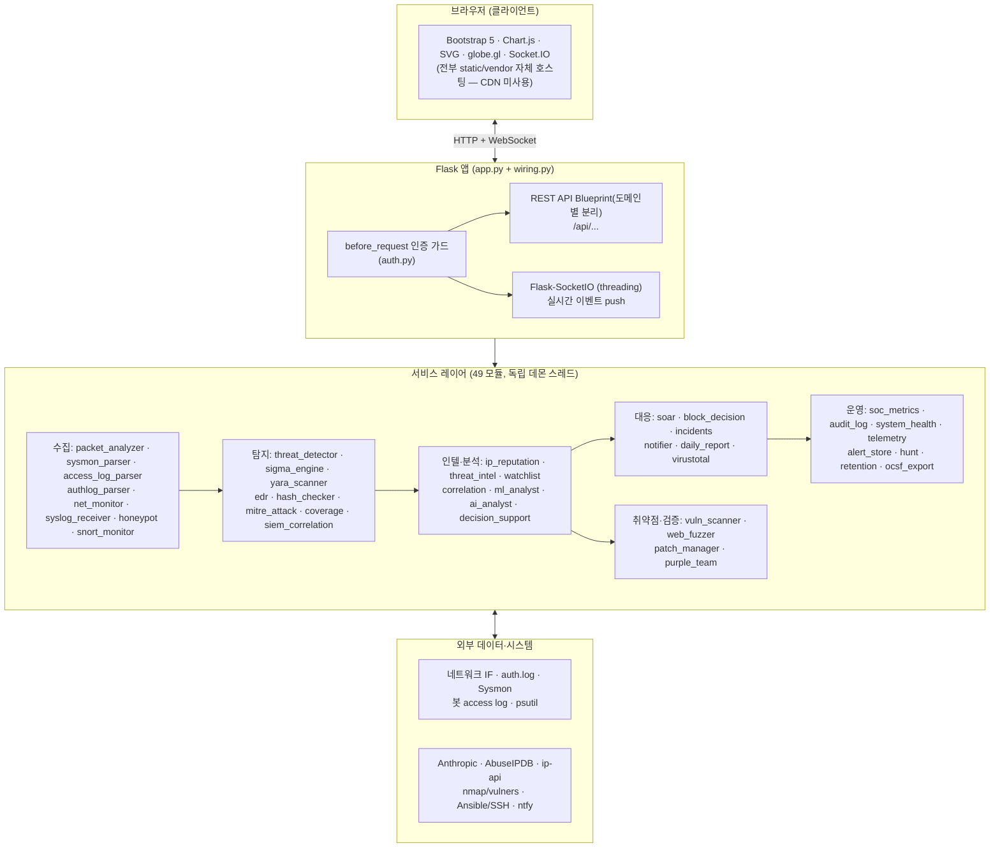
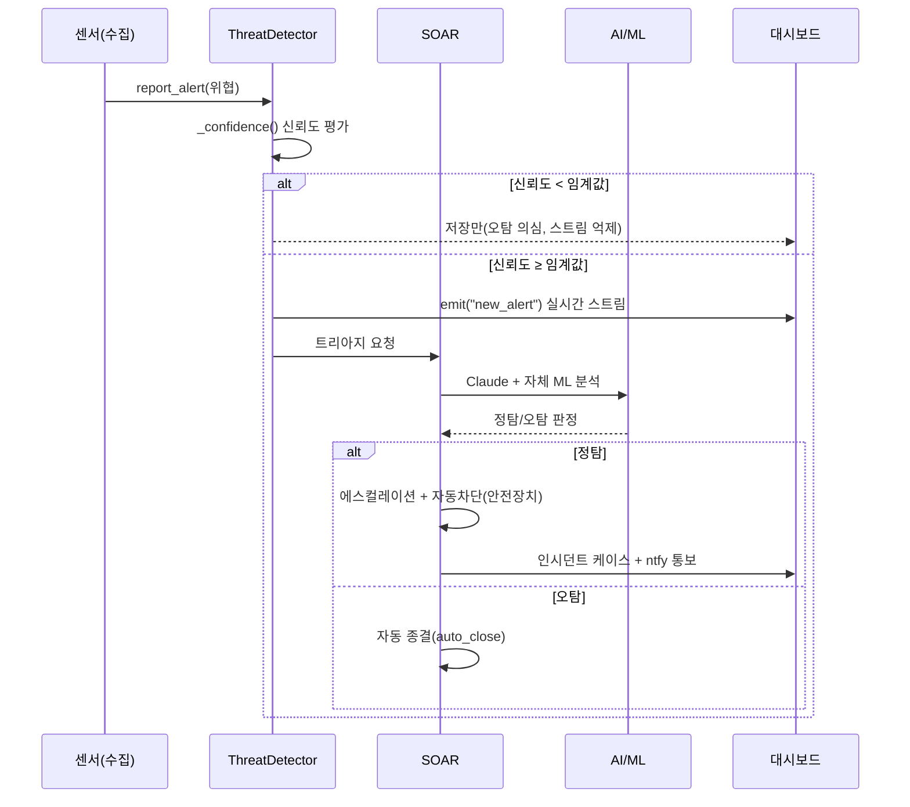

# 아키텍처 설명

## 전체 구조



Flask 앱 팩토리(`create_app`)는 SocketIO 이벤트만 담당하고, 서비스 생성·교차배선·시작은
`wiring.py`(`build_services` / `start_services`)가 처리해 각 서비스를 `app.<name>` 으로 등록하고
`socketio` 를 주입한다. 각 모듈은 `start()` / `stop()` / `get_*()` 인터페이스로 독립 동작하며
데모 fallback을 포함한다.

**프런트엔드**: 외부 CDN 을 쓰지 않는다. 관제 대시보드가 CDN 가용성에 의존하면
사고 대응 중에 화면이 깨지고, 격리망에서는 아예 뜨지 않는다. `static/vendor/` 에
자체 호스팅하고 CSP 를 `'self'` 로 좁혔다. JS 18개 파일은 각각 IIFE 로 감싸
공개 이름만 명시 노출한다(전역 335 → 137개).

**자기 관측성**: `system_health` 가 '모듈이 살아 있는가'를 답한다면 `telemetry` 는
'얼마나 느리고 얼마나 실패하는가'를 답한다. 문제가 실제로 숨었던 경로
(`incidents.save` · `ai.analyze` · `alert_store.search` 등)에 계측이 붙어 있다.

## 탐지 → 대응 파이프라인



## 주요 데이터 흐름

**실시간 패킷 분석**
```
네트워크 IF → PyShark/Scapy 캡처(스레드) → PacketAnalyzer._record_packet()
  → deque(maxlen) → 2초 주기 emit("packet_update") → Chart.js/DataTable
```

**자체 ML 분석**
```
packet_analyzer.get_stats() → ml_analyst.feed_traffic()(3초)
  ├→ ml_feature_store.record() → data/ml_features.db (real/demo 구분)
  └→ Isolation Forest → emit("ml_analysis")   ※ 참고용, 탐지 경로 미연결
RF·LSTM·Q-Learning 은 experimental/ 로 격리됨
```

**MITRE ATT&CK 매핑**
```
threat_detector._add_alert() / sysmon_parser._record_event()
  → mitre_tracker.map_threat() → hits[(tactic, technique)] += 1
  → emit("mitre_hit") → 매트릭스 셀 실시간 강조
```

**취약점 스캔 + 교차검증**
```
vuln_scanner.scan() → nmap -sV(+vulners) 또는 소켓 배너 스캔
  → _cross_validate(): 서비스→패키지 매핑 → apt 패치상태 대조
     (localhost=직접 apt/dpkg, 원격=ansible -m shell 읽기전용)
  → verdict: vulnerable(정탐) / patched(오탐) / unknown
  → emit("vulnscan_host")
```

**IOC 워치리스트 · 킬체인 상관관계**
```
threat_detector._add_alert() → watchlist.match_alert(src_ip, dst_ip)
  → 히트 집계 + emit("watchlist_hit") + alert.details["watchlist"]

alert_store.since(hours) → correlation.build_campaigns()
  → 같은 src_ip를 시간 윈도우로 그룹 → MITRE 전술 순서로 단계 정렬
  → 다단계 캠페인(공격 스토리) → /api/correlation/campaigns
```

**SOC 운영 지표 · 감사 로그**
```
alert_store.aggregate(days) + incidents 타임라인 → soc_metrics.compute()
  → MTTR/MTTA·오탐율·히트맵·TOP → /api/metrics/soc

알림 ACK/종료·SOAR 차단·인시던트 변경 → api._common.audit_record()
  → audit_log.record(actor=session, ...) (append-only) → /api/audit
```

## 스레드 구조

각 서비스는 독립 데몬 스레드로 실행되며, SocketIO emit은 `deque`·`Lock`으로 스레드 안전하게 처리한다.

| 스레드/워커 | 역할 |
|-------------|------|
| 패킷 캡처/emit | PyShark/Scapy 캡처(또는 데모) + 2초 주기 통계 전송 |
| Sysmon 읽기/emit | Windows 이벤트 로그(또는 데모) + 3초 주기 전송 |
| AI 워커 | Claude 분석 비동기 큐 처리 |
| SIEM/authlog tail | 봇 access log · auth.log 실시간 tail |
| EDR/NetMon 스캔 | psutil 주기 스캔(프로세스 IOA · 연결/포트) |
| 취약점 스캔/퍼징 | 온디맨드 백그라운드(사용자 트리거) |
| 일일 리포트 | 정해진 시각 자동 브리핑 |
| Syslog 수신 | UDP+TCP 5514 (연결당 상한 있음) |
| 허니팟 리스너 | 유인 포트별 accept 루프 (연결당 상한 있음) |
| YARA 디렉터리 감시 | `YARA_WATCH_DIRS` 의 새/변경 파일 스캔 |
| 보존 정리 루프 | 6시간 주기 — 알림·아카이브·감사·파일·인시던트·SOAR·결정기록 |

### DB 동시성

| 저장소 | 방식 |
|--------|------|
| 쓰기 | 저장소마다 단일 커넥션 + `threading.Lock` |
| 조회(`alert_store`) | **스레드마다 별도 커넥션**(`query_only`) — 락 없음 |
| 전 저장소 | WAL + `synchronous=NORMAL` + `busy_timeout=10s` |

조회를 스레드별로 나누는 이유: 커넥션 하나를 락으로 공유하면 WAL 의 동시 읽기가
무의미해진다. 실측(11만 건)으로 단독 62ms 인 `search(50)` 이 `aggregate` 와 겹치면
4,088ms — **66배**였다. 집계는 짧은 TTL 캐시 + single-flight 로 같은 창을 동시에
물어도 한 번만 계산하고, 응답의 `age_seconds` 로 신선도를 노출한다.

> **아카이브 이동은 2단계 커밋이다.** WAL 에서 SQLite 는 ATTACH 된 DB 를 아우르는
> 커밋의 원자성을 보장하지 않으므로, 복사와 삭제를 한 트랜잭션에 두면 크래시 시
> 삭제만 반영돼 알림이 유실될 수 있다. 복사를 먼저 커밋해 최악을 '중복'으로 만들고,
> 기동 시 `_recover_interrupted_archive()` 가 잔재를 정리한다.

## 온디맨드 vs 상시

- **상시(주기)**: 패킷·Sysmon·SIEM·authlog·EDR·NetMon·ML·일일리포트
- **온디맨드(트리거)**: 취약점 스캔, 웹 퍼징, 퍼플팀 시뮬레이션, Ansible 패치/명령,
  YARA 수동 스캔, 헌팅 쿼리 실행, 차단 결정 재생(replay), OCSF 내보내기, AI 챗봇

## 보안·안전 고려사항

- 패킷 캡처·auth.log는 권한 필요 / API 키는 `.env` 관리(하드코딩 금지) / `SECRET_KEY` 랜덤 고정
- 대시보드 인증: pbkdf2 해시 + IP별 브루트포스 락아웃 + 세션 가드(전 라우트 `before_request`)
- **운영 서버 보호**: 취약점 스캔은 비파괴 connect, 패치는 dry-run 기본+게이트, 파괴적 명령 blocklist,
  퍼징은 사설 대상만·GET 전용, SOAR 차단은 사설·Tailscale·자기자신 allowlist 보호
- Tailscale로 외부 접속 시 HTTP이므로 세션 쿠키 `Secure`는 환경변수로 제어
- **CORS/CSRF**: 기본 same-origin. 상태변경 요청은 Origin/Referer 검증. 조회 전용
  엔드포인트(헌팅 실행·결정 재생 등)는 GET 이라 CSRF 게이트를 붙이지 않는다
- **보안 헤더**: CSP(`script/style/font/img-src 'self'`) · X-Frame-Options · nosniff ·
  Referrer-Policy · Permissions-Policy. CSP 의 `script-src` 에는 `'unsafe-inline'` 이
  남아 있다 — 인라인 핸들러 132개 때문이며, **따라서 CSP 는 XSS 스크립트 주입을
  막지 못한다.** 그 사실을 숨기지 않는다
- **스캐너 자체가 취약점이 되지 않도록**: YARA/해시 수동 스캔은 `HASH_SCAN_ALLOWED_DIRS`
  로 경로를 제한하고, 심볼릭 링크를 따라가지 않으며(경로 탈출), 파일 크기·타임아웃·
  파일 수 상한을 둔다. 매치 결과에 원문 페이로드를 담지 않는다
- **자동 차단은 3층 게이트**: `evaluate_gates()` 판정 → 안전장치(`_is_blockable`) →
  승인 큐. **안전장치가 게이트보다 우선**하고, 그 결과가 결정 기록에 그대로 남는다
  (`blocked` / `queued_for_approval` / `prevented_by_safety` / `gates_not_met`)
- **기동 시 위험 조합 경고**: `DEBUG=True`(Werkzeug 디버거 RCE)나 비루프백 바인딩 +
  `AUTH_ENABLED=False` 면 경고한다. 다만 **기동을 막지는 않는다** — 관제 도구가 제
  판단으로 기동을 거부하면 그게 더 큰 사고다
